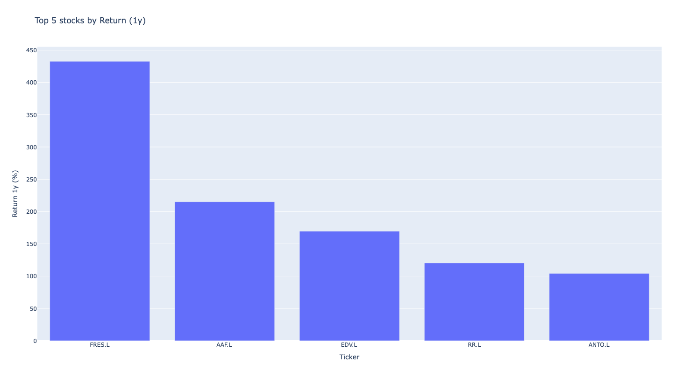

# Stock Analysis App

A container-ready stock analysis backend that ranks stocks by performance metrics over selectable time windows.     
This MVP is designed to be deployed on Azure and embedded into a personal webpage.


## 🚀 Current Status

**Phase 2 complete**

✔ Data pipeline implemented (CSV-based)  
✔ FastAPI backend implemented  
✔ Metrics validated and exposed via REST API  
✔ Error handling and input validation in place  
✔ Ready for containerisation and Azure deployment  


## 📌 Features (MVP)

- Uses **historical stock data (last 5 years)**
- Supports ranking stocks by:
  - Percentage return
  - Volatility
  - P/E ratio
  - Market capitalisation
- User-selectable:
  - Metric
  - Time window (e.g. 3m, 6m, 1y, 3y, 5y)
  - Top-N results
- Clean, discoverable REST API
- Designed for daily scheduled data updates

---

## 🗂 Project Structure

```
project_root/
├── app/
│   ├── init.py
│   ├── main.py              # FastAPI entry point
│   ├── config.py            # App configuration & paths
│   ├── api/
│   │   ├── init.py
│   │   ├── routes.py        # API endpoints
│   │   └── schemas.py       # Pydantic response models
│   ├── services/
│   │   ├── init.py
│   │   └── metrics_service.py  # Business logic
│   └── data/
│       └── stock_metrics.csv      # Precomputed metrics (data contract)
├── requirements.txt
└── README.md
```

---

## 📊 Data Contract

The backend expects a **CSV file** at: app/data/stock_metrics.csv

### Example
```csv
Ticker,Return_5d,Return_1mo,Return_3mo,Volatility_3mo,Market Cap,P/E Ratio
AZN.L,2.0945454545454547,3.2813419658622722,10.205683780813315,0.17520005255578405,21933411339996.0,3179.325842696629
BATS.L,-3.7902264600715134,-6.191603316109972,5.4211343679679596,0.20646147807939425,8695913248581.162,2880.0273648268885

```

## 🧪 Running Locally

1. Install dependencies
```
pip install -r requirements.txt
```

2. Get updated data for all stocks.

```
cd app/data
python fetch_data.py
python compute_metrics.py
```
This should update the files stock_data.csv and stock_metrics.csv with the latest information.

3. Run from project root
```
uvicorn app.main:app --reload
```

4. Open in Browser
- Health check:         http://127.0.0.1:8000/
- API docs (Swagger):   http://127.0.0.1:8000/docs
- View results graphically: http://127.0.0.1:8000/api/graph?metric=Return&window=1y&n=5




## ✅ Verification Checklist

The app is working correctly if:

- / returns { "status": "ok" }

- /docs loads without errors

- /api/top returns ranked results

- Invalid metrics/windows return HTTP 400

- Restarting the app produces no schema errors


## 🔜 Next Steps

Planned next phases:

- Containerisation (Docker)
- Azure App Service Deployment
- Azure function for daily data updates (11 PM)
- Frontend visualisation (Plotly / JavaScript)
- ML-based predictions


## 🧠 Design Principles

- Data contract first
- Flat tables for APIs
- Explicit schema validation
- Container- and cloud-first design
- Minimal MVP scope for easy extensions in future

## 👤 Author
Built as a pesonal stock analysis and visualisation project by Prashant Saxena. Designed for public deployment and experimentation.